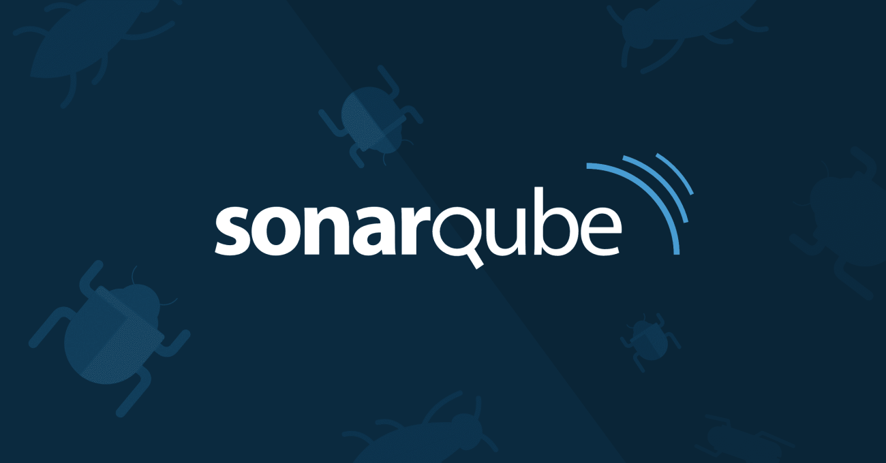

# Hoe SonarQube bijdraagt aan codekwaliteit en DevOps optimalisatie

*[Joris Wittenberg, oktober 2024.](https://github.com/hanaim-devops/devops-blog-jwittenberg/tree/main/src/sonarqube-blog-post)*

<hr>


SonarQube, voorheen bekend als Sonar, is een opensourceplatform ontworpen om de kwaliteit van softwarecode te beheren. Het biedt ontwikkelaars een hulpmiddel om hoogwaardige code te leveren door inzicht te bieden in de algemene codekwaliteit. Vanuit een overzicht kunnen gebruikers eenvoudig doorklikken naar specifieke regels waar problemen zich voordoen. SonarQube is uitbreidbaar via plugins en ondersteunt een breed scala aan programmeertalen. Het platform kan code analyseren om kwaliteit gerelateerde aandachtspunten te identificeren, zoals duplicaten in code, falende testen en andere potentiële problemen. (Nauta & Nauta, 2016)
Dit onderzoek zal de hoofdvraag “Hoe kan SonarQube bijdragen aan het verbeteren van de codekwaliteit en de efficiëntie van softwareontwikkelingsprocessen?” doormiddel van de volgende deelvragen:

- Hoe draagt SonarQube bij aan het verbeteren van de codekwaliteit binnen softwareontwikkelingsprojecten?
(Impact van SonarQube op codekwaliteit en ontwikkelprocessen.)
- Welke mogelijkheden biedt SonarQube voor het detecteren en oplossen van veelvoorkomende codeproblemen?
(Specifieke functionaliteiten en analysemogelijkheden van het platform.)
- Hoe kunnen organisaties SonarQube effectief implementeren en integreren in hun bestaande ontwikkelworkflow?
(Implementatiestrategieën en integratie in tools zoals CI/CD pipelines.)

## Implementeren Sonarqube
Voordat op de deelvragen wordt ingegaan, wordt de implementatie van SonarQube in een ontwikkelomgeving getoond.

```yaml
version: '3.7'
services:
  sonarqube:
    image: sonarqube:latest
    container_name: sonarqube
    ports:
      - "9000:9000"
    environment:
      - SONAR_ES_BOOTSTRAP_CHECKS_DISABLE=true
      - SONAR_JDBC_URL=jdbc:postgresql://db/sonar
      - SONAR_JDBC_USERNAME=sonar
      - SONAR_JDBC_PASSWORD=sonar
    depends_on:
      - db
    networks:
      - sonarnet

  db:
    image: postgres:latest
    container_name: sonarqube_db
    environment:
      POSTGRES_USER: sonar
      POSTGRES_PASSWORD: sonar
      POSTGRES_DB: sonar
    networks:
      - sonarnet

networks:
  sonarnet:
```

### Stappen voor het integreren van SonarQube in een C#-project

1. **Start SonarQube**:
   - Open een terminal in de map waar je het bovenstaande `docker-compose.yml` bestand hebt opgeslagen.
   - Voer het volgende commando uit om de SonarQube-server en de database te starten:
     ```bash
     docker-compose up -d
     ```
   - Controleer of de SonarQube-server draait door naar `http://localhost:9000` te gaan in je webbrowser.

2. **Installeer de SonarScanner CLI**:
   - Download de SonarScanner for .NET via de [officiële documentatie](https://docs.sonarsource.com/sonarqube/latest/analysis/scan/sonarscanner-for-msbuild/).
   - Installeer het via NuGet in je project:
     ```bash
     dotnet tool install --global dotnet-sonarscanner
     ```

3. **Configuratiebestand maken**:
   - Voeg een bestand `sonar-project.properties` toe aan de hoofdmap van je project met de volgende inhoud:
     ```properties
     sonar.projectKey=sonarqubedemo
     sonar.host.url=http://localhost:9000
     sonar.login=sonarqubedemo-token
     ```

   - Genereer een token in SonarQube:
     - Log in op `http://localhost:9000` (gebruik standaardgebruikersnaam `admin` en wachtwoord `admin`).
     - Ga naar **Mijn account > Security > Tokens** en genereer een token.

4. **Analyse uitvoeren**:
   - Open een terminal in de hoofdmap van je C#-project.
   - Initialiseer de analyse met het volgende commando:
     ```bash
     dotnet sonarscanner begin /k:"sonarqubedemo" /d:sonar.login=<your-sonarqube-token>
     ```
   - Bouw het project:
     ```bash
     dotnet build
     ```
   - Voer de analyse uit:
     ```bash
     dotnet sonarscanner end /d:sonar.login=<your-sonarqube-token>
     ```

5. **Resultaten bekijken**:
   - Ga terug naar `http://localhost:9000` en bekijk de resultaten van de analyse. Hier vind je een overzicht van de codekwaliteit, beveiligingsproblemen, technische schuld en meer.

## Hoe draagt SonarQube bij aan het verbeteren van de codekwaliteit binnen softwareontwikkelingsprojecten?

Nu de implementatie van SonarQube in een ontwikkelomgeving is toegelicht, kunnen we verder kijken naar hoe dit platform de codekwaliteit verbetert. SonarQube biedt ontwikkelaars inzicht in potentiële problemen, zoals duplicaten, technische schuld en beveiligingskwetsbaarheden. Dit stelt teams in staat om codeproblemen proactief aan te pakken en de kwaliteit van software te verbeteren.

### Detecteren en elimineren van technische schuld
SonarQube identificeert problemen zoals slechte structuur, onleesbare code en onnodige complexiteit. Door deze problemen aan te pakken, verbeteren ontwikkelteams de onderhoudbaarheid van de code en verminderen ze het risico op fouten en kwetsbaarheden.

### Analyseren van codekwaliteit
Het platform biedt uitgebreide statistieken en kwaliteitsmetingen, zoals het opsporen van code duplicaten, het beoordelen van codecomplexiteit en het controleren van formatteringsstandaarden. Dit helpt teams om een consistente en kwalitatieve codebase te behouden.

### Verbeteren van softwarebeveiliging
SonarQube controleert code op kwetsbaarheden en onveilige praktijken, zoals het gebruik van kwetsbare bibliotheken en bekende beveiligingsproblemen. Dit maakt het een onmisbaar hulpmiddel voor het waarborgen van de veiligheid en betrouwbaarheid van software.

Met deze functies bevordert SonarQube een cultuur van continue verbetering. Door voortdurend feedback te geven op basis van duidelijke kwaliteitsnormen, ondersteunt het platform ontwikkelaars bij het maken van bewuste en kwalitatieve keuzes in nieuwe en bestaande code. Dit versterkt niet alleen de codekwaliteit op korte termijn, maar verhoogt ook de efficiëntie en betrouwbaarheid van softwareontwikkelingsprojecten als geheel. (MIVOCLOUD LIMITED, 2023)

In deze deelvraag is de bredere impact van SonarQube op codekwaliteit besproken. In de volgende deelvraag zullen we ons richten op specifieke functionaliteiten voor het detecteren en oplossen van concrete codeproblemen.

## Welke mogelijkheden biedt SonarQube voor het detecteren en oplossen van veelvoorkomende codeproblemen?

SonarQube biedt een breed scala aan functionaliteiten en analysemogelijkheden die ontwikkelteams ondersteunen bij het opsporen en oplossen van veelvoorkomende codeproblemen. De belangrijkste mogelijkheden zijn:

### 1. **Detecteren van bugs en codefouten**
SonarQube voert statische code-analyse uit om fouten en bugs in de code te identificeren. Deze fouten worden gecategoriseerd op basis van ernst (bijvoorbeeld "blocker", "critical" of "minor"), zodat ontwikkelaars prioriteit kunnen geven aan het oplossen van de meest dringende problemen. Voorbeelden zijn ongedefinieerde variabelen, foutieve logica of ongeldige API-aanroepen. (Aid, 2022b)

### 2. **Rapportage en dashboardfuncties**
SonarQube biedt uitgebreide dashboards en rapportages waarmee teams real-time inzicht krijgen in de status van hun codebase. Probleemtrends kunnen worden gevolgd, en teams kunnen aangepaste regels of filters toepassen om analyses af te stemmen op specifieke projecten. (Aid, 2022b)

### 3. **Beveiligingsanalyse**
Met ingebouwde beveiligingsregels en ondersteuning voor OWASP-richtlijnen kan SonarQube veelvoorkomende beveiligingsproblemen identificeren, zoals SQL-injecties, Cross-Site Scripting (XSS) en het gebruik van kwetsbare bibliotheken. Dit draagt bij aan het waarborgen van veilige softwareontwikkeling. (Aid, 2022b)

### 4. **Opsporen van duplicaten in code**
Code duplicatie is een veelvoorkomend probleem dat de onderhoudbaarheid van software bemoeilijkt. SonarQube detecteert dubbele codeblokken en rapporteert deze, zodat ontwikkelaars ze kunnen refactoren. Dit verbetert de leesbaarheid en vermindert technische schuld. (Chakraborty & Chakraborty, 2024)

### 5. **Beoordelen van codecomplexiteit**
SonarQube analyseert cyclomatische complexiteit en andere metriek, zoals het aantal afhankelijkheden binnen een codebase. Hoge complexiteitswaarden wijzen vaak op code die moeilijk te begrijpen en te onderhouden is. Door complexiteit te verminderen, kan de algehele codekwaliteit verbeteren. (Chakraborty & Chakraborty, 2024)

### 6. **Controleren van codestandaarden**
SonarQube controleert code op naleving van vooraf ingestelde codestandaarden en conventies. Dit helpt teams om consistentie binnen de codebase te handhaven en common best practices te volgen. (Chakraborty & Chakraborty, 2024)


---

### Conclusie
SonarQube biedt ontwikkelteams krachtige hulpmiddelen om veelvoorkomende codeproblemen te detecteren en op te lossen. Door statische analyse, naleving van codestandaarden en beveiligingscontroles te combineren met integraties in CI/CD-pijplijnen, stelt SonarQube teams in staat om continu te werken aan een kwalitatieve en veilige codebase.

## Conclusie

SonarQube speelt een belangrijke rol in het verbeteren van codekwaliteit en het optimaliseren van DevOps-processen. Door middel van juiste integraties en best practices kunnen organisaties de voordelen van continue code-analyse volledig benutten en hun softwareontwikkeling naar een hoger niveau tillen.

## Bronnen

- [Nauta, L., & Nauta, L. (2016, April 8). SonarQube. NLJUG - Nederlandse Java User Group.](https://nljug.org/java-magazine/sonarqube/#:~:text=SonarQube%20(vroeger%20Sonar%20genoemd)%20is,kwaliteit%20code%20op%20te%20leveren.) Geraadpleegd op 10 januari 2024.
- [MIVOCLOUD LIMITED. (2023, 14 juni). SonarQube: Why it is needed, what advantages and where it is used. Mivocloud.](https://mivocloud.com/en/blog/SonarQube-why-it-is-needed-what-advantages-and-where-it-is-used) Geraadpleegd op 10 januari 2024.
- [Aid. (2022b, maart 24). Improving Code Quality with Static Code Analysis Using SonarQube: A Practical Guide. Apriorit.](https://www.apriorit.com/qa-blog/765-qa-improving-code-quality-using-sonarqube) Geraadpleegd op 10 januari 2024.
- [Chakraborty, P., & Chakraborty, P. (2024, 26 juli). How to Use SonarQube for Code Quality Analysis. PixelFreeStudio Blog -.](https://blog.pixelfreestudio.com/how-to-use-sonarqube-for-code-quality-analysis/) Geraadpleegd op 10 januari.